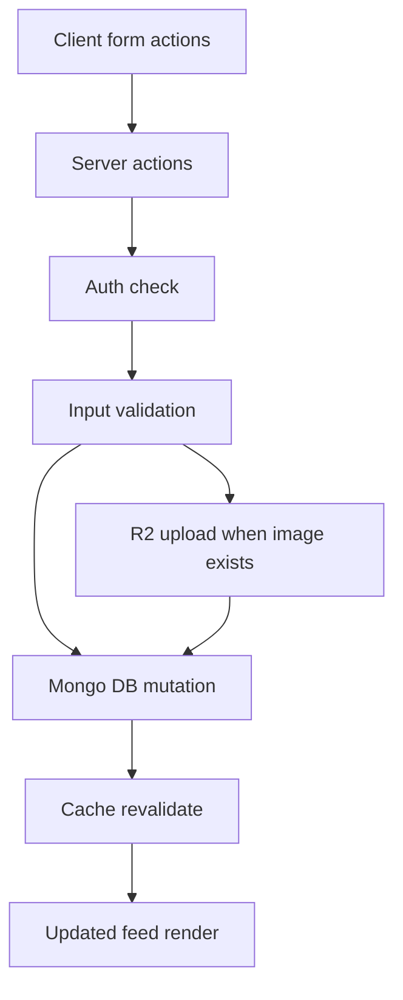

# LinkedIn Clone Stabilization and Improvement Plan

## Goals

1. Make core posting, commenting, liking, and deleting flows reliable and secure.
2. Remove API inconsistency and duplicate logic between server actions and route handlers.
3. Improve UX quality for common user actions and error states.
4. Prepare a clean base for adding larger product features next.

## Audit Summary and Priority Issues

### P0 Reliability and Correctness

- Missing success response in delete route can cause hanging or ambiguous client behavior in [`DELETE`](../app/api/posts/[posts_id]/route.ts).
- Inconsistent auth protection across API routes such as [`POST`](../app/api/posts/[posts_id]/comments/route.ts) and [`POST`](../app/api/posts/[posts_id]/like/route.ts).
- Some routes do not consistently establish DB connection before DB operations.
- Input validation is weak or inconsistent across handlers and actions.
- Route handlers and server actions duplicate responsibilities in places, increasing bug surface.

### P1 Data and Type Integrity

- Likes field type in schema and usage should be normalized for stable includes and filters in [`PostSchema`](../mongodb/models/posts.ts).
- Multiple unused imports and unused local objects create noise and increase maintenance risk.

### P1 UX Stability

- Optimistic like flow does not always recover cleanly if follow-up fetch fails in [`likeOrUnlikePost`](../components/PostOptions.tsx).
- Missing robust empty and error states in several surfaces.

### P2 Product Polish and Feature Opportunity

- Repost and Send actions are placeholders in [`PostOptions`](../components/PostOptions.tsx) and should be either hidden or marked not available.
- Search box in header is not wired yet in [`Header`](../components/Header.tsx).

## Implementation Strategy

### Phase 1 Core API Hardening

1. Standardize auth policy per route
   - Public read routes remain open.
   - Mutating routes require authenticated user and verify ownership when applicable.
2. Ensure every route follows predictable response contract
   - Return success JSON and proper status code for all success branches.
   - Return explicit 400 401 403 404 500 where applicable.
3. Centralize validation and normalization
   - Trim text inputs.
   - Reject empty text posts and comments after trim.
   - Validate route params and body payload shape before DB use.
4. Enforce DB connection consistency
   - Call DB connect in every route and server action that touches DB.

Files in scope

- [`app/api/posts/route.ts`](../app/api/posts/route.ts)
- [`app/api/posts/[posts_id]/route.ts`](../app/api/posts/[posts_id]/route.ts)
- [`app/api/posts/[posts_id]/comments/route.ts`](../app/api/posts/[posts_id]/comments/route.ts)
- [`app/api/posts/[posts_id]/like/route.ts`](../app/api/posts/[posts_id]/like/route.ts)
- [`app/api/posts/[posts_id]/unlike/route.ts`](../app/api/posts/[posts_id]/unlike/route.ts)

### Phase 2 Server Action Cleanup

1. Remove unused imports and redundant temporary objects in actions.
2. Normalize error handling to throw actionable messages and revalidate only after successful mutation.
3. Keep action logic aligned with route contracts and schema constraints.

Files in scope

- [`actions/createPostActions.ts`](../actions/createPostActions.ts)
- [`actions/createCommentAction.ts`](../actions/createCommentAction.ts)
- [`actions/deletePostAction.ts`](../actions/deletePostAction.ts)

### Phase 3 Schema and Model Consistency

1. Normalize likes type and default values for predictable behavior.
2. Improve static and method return safety for TypeScript strict mode.
3. Remove dead imports and cleanup model code paths.

Files in scope

- [`mongodb/models/posts.ts`](../mongodb/models/posts.ts)
- [`mongodb/models/comments.ts`](../mongodb/models/comments.ts)

### Phase 4 UX and Interaction Hardening

1. Improve like and comment UX
   - Add disabled states during network operations.
   - Prevent duplicate rapid taps and race updates.
   - Make rollback deterministic on failed optimistic updates.
2. Clarify unavailable actions
   - Hide or disable placeholder actions with tooltip style note.
3. Improve empty and error states
   - Feed error fallback.
   - Comment load fallback.

Files in scope

- [`components/PostOptions.tsx`](../components/PostOptions.tsx)
- [`components/Feed.tsx`](../components/Feed.tsx)
- [`components/CommentFeed.tsx`](../components/CommentFeed.tsx)
- [`components/Header.tsx`](../components/Header.tsx)

### Phase 5 Quality Gates

1. Lint and type safety checks.
2. Build check for runtime route compatibility.
3. Manual smoke tests for top user journeys.

Commands

- [`npm run lint`](../package.json)
- [`npm run build`](../package.json)

## Suggested Manual Test Matrix

1. Create post with text only.
2. Create post with text and image.
3. Reject empty post and empty comment after trim.
4. Like and unlike as authenticated user and verify count.
5. Attempt mutation unauthenticated and verify protected behavior.
6. Delete own post and verify feed refresh.
7. Try deleting another user post and verify forbidden behavior.
8. Open feed with no posts and verify empty state.

## Optional Next Features after Stabilization

1. Edit post text for author.
2. Delete comment for author or post owner.
3. Basic search over user name and post text.
4. Pagination or infinite scroll for large feeds.
5. Image resize compression before upload to reduce bandwidth.

## Architecture Flow Overview

## Implementation Checklist for Code Mode

- [ ] Harden API handlers with auth validation and status contracts
- [ ] Align server actions with hardened API and remove duplication noise
- [ ] Normalize schema and model types for likes comments and image fields
- [ ] Harden optimistic UI and loading states in like comment flows
- [ ] Resolve placeholder actions and improve fallback states
- [ ] Run lint build and complete manual smoke matrix
- [ ] Update docs if route contracts or env requirements change
